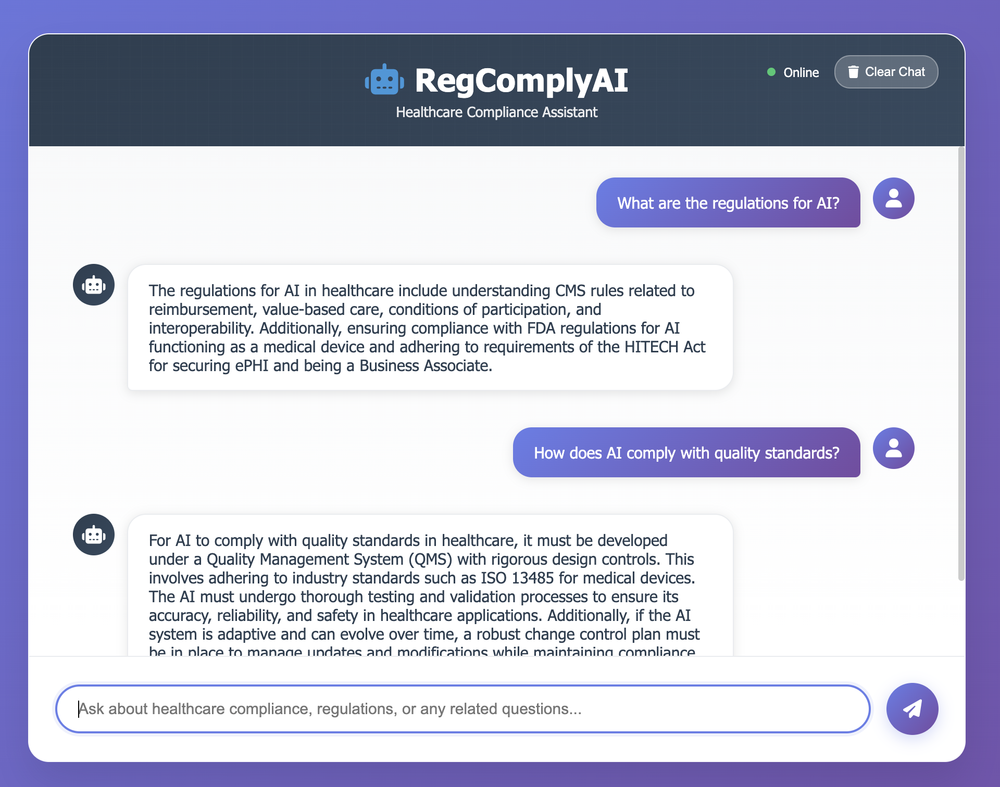

# RegComplyAI 🏥⚖️

**Regulatory Compliance AI for Healthcare**
Welcome to **RegComplyAI**, an AI-powered knowledgebase designed to help healthcare organizations navigate and maintain compliance with U.S. healthcare regulations. This repository leverages Retrieval-Augmented Generation (RAG) technology to provide quick access to regulatory information, compliance guidelines, enforcement actions, and best practices for major healthcare regulations including HIPAA, HITECH, FDA, and CMS guidelines.

## ⚠️ Important Disclaimer

The content in this repository is **AI-generated** and should be used **only as an example or reference**. It is **not guaranteed to be accurate, complete, or legally valid**. Do **not** use this material as a substitute for professional legal, compliance, or regulatory advice. Always consult official sources and qualified experts before making compliance-related decisions.

## 🚀 Features

- **AI-Powered Search**: Query healthcare regulations using natural language
- **Comprehensive Coverage**: Includes HIPAA, HITECH, FDA, and CMS regulations
- **Real-World Examples**: Access to enforcement actions and case studies
- **Best Practices**: Implementation guidelines for compliance measures
- **Chat History**: Maintains conversation context for better assistance
- **Dual Interface Options**: Choose between Gradio or custom UI

## 📂 Repository Structure

```
RegComplyAI/

├── knowledgebase/                  # Markdown files containing regulatory knowledge
│   ├── best-practices/             # Industry best practices documents
│   ├── compliance-guidelines/      # Guidelines for regulatory compliance
│   ├── enforcement-actions/        # Case studies of enforcement actions
│   ├── regulation-changes/         # Updates and changes in regulations
│   └── regulations/                # Summaries of existing regulations

├── notebook/RAG.ipynb               # Jupyter notebook for RAG experiments / prototyping

├── src/                            # Main source code
│   ├── __init__.py                 # Makes src a Python package
│   ├── chains/conversation.py      # Logic for conversation chains / RAG pipelines
│   ├── config/settings.py          # Configuration settings for the project
│   ├── data/loader.py              # Data loading utilities
│   ├── data/splitter.py            # Data splitting utilities for training/testing
│   ├── interface/gradio_ui.py      # Gradio UI interface for model interaction
│   ├── utils/exception.py          # Custom exception handling
│   ├── utils/logger.py             # Logging utilities
│   └── vectorstore/                # Vector store utilities for embeddings
│       ├── embeddings.py           # Logic to generate embeddings
│       └── store.py                # Store/retrieve embeddings from vector DB

├── static/                         # Frontend assets
│   ├── images/RegComplyAI.png      # Logo/image used in the app
│   └── old_simple_ui_style.css     # CSS for legacy UI

├── templates/                      # HTML templates for web interface
│   ├── index.html                  # Main app page
│   └── old_simple_ui_index.html    # Legacy UI page

├── app.py                           # FastAPI / Flask app entry
├── main.py                          # Main script to run the application
├── README.md                        # Project documentation
├── requirements.txt                 # Python dependencies
├── setup.py                         # Package setup script
```

## 🛠️ Installation & Setup

### 1. Environment Setup
Create a new Python environment to avoid dependency conflicts:

```bash
# Create virtual environment
python -m venv regcomplyai-env

# Activate environment
# On Windows:
regcomplyai-env\Scripts\activate
# On macOS/Linux:
source regcomplyai-env/bin/activate
```

### 2. Install Dependencies
```bash
pip install -r requirements.txt
```

### 3. Configure API Key
Create a `.env` file in the main directory and add your OpenAI API key:

```env
OpenAI_API_KEY=sk-your-api-key-here
```

**Note**: Replace `sk-your-api-key-here` with your actual OpenAI API key.

## 🚀 Running the Application

RegComplyAI offers two interface options:

### Option 1: Gradio Interface (Recommended for Quick Start)
Launch the Gradio-based chatbot for a simple, web-based interface:

```bash
python -m main
```

### Option 2: Custom UI
Run the custom user interface for enhanced features:

```bash
python -m app
```

Both interfaces will be accessible through your web browser and will display the URL in the terminal. 

Note: To see the UI
- Gradio interface: http://127.0.0.1:7860
- Custom UI: http://localhost:8080/

## 🔍 How to Use

Once the application is running, you can interact with the AI assistant by asking questions such as:

- **"What are the key components of HIPAA compliance?"**
- **"What are the penalties for HIPAA violations?"**
- **"How can I ensure my healthcare organization is compliant with HITECH?"**
- **"What are the recent changes in FDA medical device regulations?"**
- **"Show me examples of CMS enforcement actions."**

The AI assistant will search through the regulatory documents and provide comprehensive responses based on the relevant content. The system maintains chat history, allowing for contextual follow-up questions.

## 🔧 Technical Features

- **Retrieval-Augmented Generation (RAG)**: Combines AI language models with regulatory document retrieval

      💡 Note: To save cost, we do not pass the entire dataset to the model. Instead, we embed documents and retrieve only the relevant information for the user’s question.

- **Contextual Memory**: Maintains conversation history for better understanding
- **Markdown Processing**: Structured content organization for optimal retrieval
- **Real-time Search**: Instant access to relevant regulatory information
- **Scalable Architecture**: Easily extensible for additional regulations