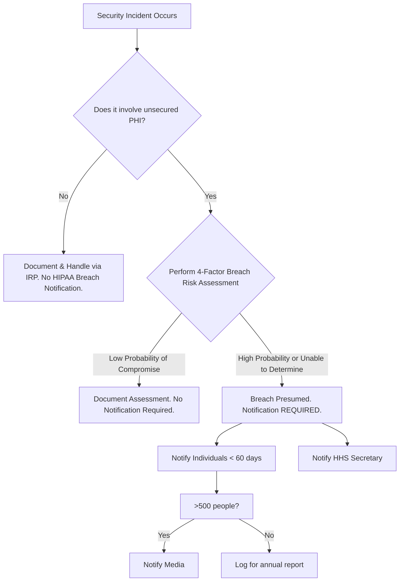

# Incident Response & Breach Notification Protocol

## Overview
A swift and organized response to a security incident is critical to mitigating damage and ensuring compliance with the HIPAA Breach Notification Rule. This guideline provides a step-by-step action plan.

## Phase 1: Preparation (Before an Incident Occurs)

*   **Action Step:** Form an **Incident Response Team (IRT)**.
    *   **Membership should include:** IT Security, Compliance Officer, Legal Counsel, HR, and Public Relations.
*   **Action Step:** Develop a formal **Incident Response Plan (IRP)**.
    *   **The plan should define:** Roles and responsibilities, communication channels, and procedures for containment, eradication, and recovery.
*   **Action Step:** Conduct tabletop exercises to test the plan.

## Phase 2: Identification & Containment (0 - 24 Hours)

*   **Action Step:** Identify and Confirm the Incident.
    *   **How:** Use audit logs, system alerts, or user reports to confirm a potential breach. Don't assume it's a false positive.
*   **Action Step:** Activate the IRT and initiate the IRP.
*   **Action Step:** Take immediate steps to **contain** the breach.
    *   **Examples:** Disconnect compromised systems from the network, disable breached user accounts, revoke access keys, or take a website offline. **Document every action taken.**

## Phase 3: Assessment & Eradication (24 - 48 Hours)

*   **Action Step:** Perform a **Breach Risk Assessment** as required by HIPAA.
    *   **Answer the four key factors:**
        1.  **Nature of PHI:** What data was involved? (e.g., SSN vs. appointment reminder)
        2.  **Unauthorized Person:** Who accessed/acquired the data? (e.g., criminal vs. another internal department)
        3.  **Acquisition/Viewing:** Was the data actually viewed or just potentially accessed?
        4.  **Mitigation:** Have you mitigated the risk? (e.g., obtained a signed confidentiality statement from the internal department who mistakenly received it)
*   **Action Step:** **Eradicate** the threat.
    *   **How:** Remove malware, patch vulnerabilities, and change passwords for affected systems.

## Phase 4: Notification (If Required)

If the Breach Risk Assessment determines there is a **low probability** the PHI was compromised, notification is **not required**. Document the assessment to support this conclusion.

If notification **is required**, follow these mandates:

### Individual Notification
*   **Timing:** Without unreasonable delay, and no later than **60 calendar days** from discovery.
*   **Method:** By first-class mail (or email if the individual has agreed). If contact info is out-of-date, use a substitute notice (e.g., website posting for 90 days).
*   **Content:** Must include, to the extent possible:
    *   A brief description of what happened.
    *   The types of PHI involved.
    *   Steps individuals should take to protect themselves.
    *   A description of what the entity is doing to investigate, mitigate harm, and prevent future breaches.
    *   Contact procedures for questions.

### HHS Secretary Notification
*   **Breaches affecting 500+ individuals:** Notify HHS **concurrently** with individual notice.
*   **Breaches affecting <500 individuals:** Log the breach and notify HHS **no later than 60 days after the end of the calendar year**.

### Media Notification
*   **Required** for breaches affecting more than 500 residents of a state or jurisdiction.
*   **Timing:** Without unreasonable delay and in no case later than 60 days following discovery.

## Phase 5: Post-Incident Activity

*   **Action Step:** Perform a root cause analysis.
*   **Action Step:** Update policies, procedures, and technical defenses based on lessons learned.
*   **Action Step:** Retrain employees if the incident was caused by human error.
*   **Action Step:** Document everything for potential audits or investigations.

## Flowchart for Decision Making

